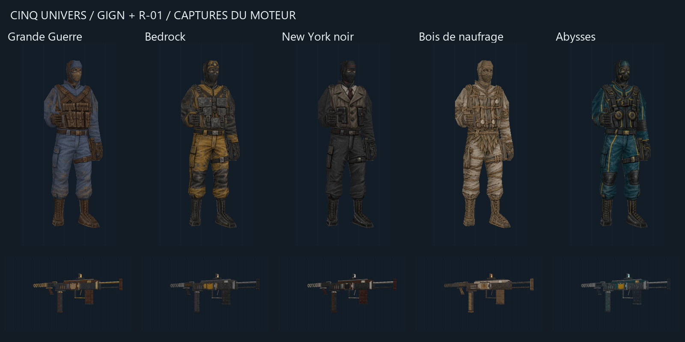

# Vector Fields 0.13.0 — version consolidée

Publication du 8 octobre 2026. Point d'entrée : **Jouer - Vector Fields.cmd**.
Cette version regroupe le travail sur les personnages, les armes et les trois
plateformes de chargement dans le même mod `runtime/vector-engine/vf_visual`.



## Nouveautés

- GIGN modulaire ajusté à ses propres polygones : tête, torse/bras, mains,
  jambes et chaussures. Un corps de 740 triangles, un squelette adapté,
  douze familles de textures et les 77 séquences compatibles existantes.
- Cinq nouveaux ensembles assortis : Grande Guerre, Bedrock, New York noir,
  Bois de naufrage et Abysses. Chaque thème comprend un atlas GIGN et un
  atlas de seize matières R1. Les nouveaux personnages sont entièrement
  couverts, avec des ouvertures qui laissent voir les yeux.
- Les six thèmes précédents restent disponibles : ruines, forge, préhistoire,
  jungle, alchimie et porcelaine, ainsi que les textures originales.
- R1 : 26 modules, douze emplacements, trois alimentations (dessous, latérale,
  supérieure), deux chargeurs interchangeables et 8 192 assemblages.
  Les animations de chargeur et de bras sont adaptées aux trois plateformes.
- Douze finitions par pièce R1 : changement global ou par emplacement,
  sans copie du maillage. Les grandes surfaces gardent une échelle UV
  identique sur les deux axes et répètent leurs motifs sans étirement.
- Ouvrir F11 et changer une arme conserve désormais le skin libre du personnage.
  Un essai d'arme local est remplacé seulement après validation du choix R1.
- Arsenal, accessoires, effets, exploration des cartes et contrôles AZERTY
  restent accessibles dans le même build.

## Utilisation

Lancer **Jouer - Vector Fields.cmd** à la racine. Le laboratoire démarre avec
la Sentinelle des tranchées et son R1 Grande Guerre. Il ouvre la page GIGN
contenant les cinq nouveaux thèmes. La fenêtre est en 1920 × 1080 sans bordure.

| Touche | Action |
| --- | --- |
| F1 | Systèmes et équipement |
| F2 | Apparence du personnage |
| F11 | Pièces, plateformes et finitions R1 |
| F7 | Arsenal |
| F3 | Effets |
| F4 | Retour au laboratoire |
| ZQSD / souris | Déplacement / regard |
| R / Espace / Ctrl | Recharger / sauter / s'accroupir |

Dans Apparence : sélectionner une tenue, « Appliquer aux 5 zones », puis
« Appliquer ». Dans R1 : choisir « Toute l'arme » ou « Cette pièce », la finition,
puis « Appliquer ». La croix ou Échap ferme l'atelier pour jouer.

Le fichier `version.json` porte l'identité de la version. Le déploiement le
copie dans le mod et utilise le même numéro dans `gameinfo.txt`. Les raccourcis
anciens sont conservés dans `legacy-launchers` pour les tests historiques ;
ils ne sont plus les points d'entrée recommandés.

## Validation

- Compilation client/serveur réussie ; 944 contrôles d'équipement et 10 601
  contrôles d'effets réussis.
- Personnages : 41 captures natives, 60 couples famille/zone, 45 arêtes de
  raccord et 44 sommets communs ; aucun écart sur 18 poses testées.
- R1 : 29 captures natives et 312 couples pièce/finition ; application,
  annulation, contrôle du catalogue et sauvegarde/reprise.
- Mapping : échelle UV 1:1 vérifiée sur les 24 formes historiques ; surfaces
  conservées. Les trois plateformes utilisent les mêmes familles de texture.
- Lanceur principal : identité 0.13.0 et 31 modèles déployés vérifiés par SHA-256.
- Ensemble personnage + R1 vérifié en jeu, après réouverture de l'atelier,
  changement de finition et sauvegarde/reprise.

Les [rapports archivés](validation) conservent les résultats de cette publication.
Les scripts reproductibles sont dans `tests` ; les captures courantes sont
locales au runtime et les nouveaux rapports dans `build`.

## Construction et contenu du dépôt

Le dépôt conserve les sources SDK modifiées, l'extension Xash3D et son patch,
les constructeurs de modèles, les atlas ImageGen avec leurs prompts, les
catalogues, les tests et la documentation. Les textures dérivées, modèles
compilés, exécutables, cartes importées, téléchargements et caches de build
sont reconstruits ou importés localement et ne sont pas ajoutés à Git.

Sur l'installation de développement préparée :

```powershell
./vector-fields/build.ps1
python vector-fields/play.py --visual-lab --deploy-only
python vector-fields/tests/current_release_test.py
& ".\Jouer - Vector Fields.cmd"
```

Pour préparer une autre machine, consulter le [guide du projet](../README.md),
le [guide du moteur](../engine/README.md) et les [imports d'assets](../../weapon-lab/README.md).
Le prototype utilise les ressources de l'installation Half-Life/CS/TFC et
les modèles de référence locaux. Ce dépôt n'est pas un installateur autonome.

## Limites actuelles

Les thèmes changent les textures, pas les silhouettes : manteau long,
bouteilles de plongée et branches saillantes demanderaient de nouveaux meshes.
Les mains en première personne conservent les gants/manches du modèle d'arme.
Le R1 garde les règles de tir et les munitions du MP5 ; son modèle porté en
vue externe reste historique. Les cartes CS/TFC sont visitables, sans les
règles complètes de leurs modes de jeu.
