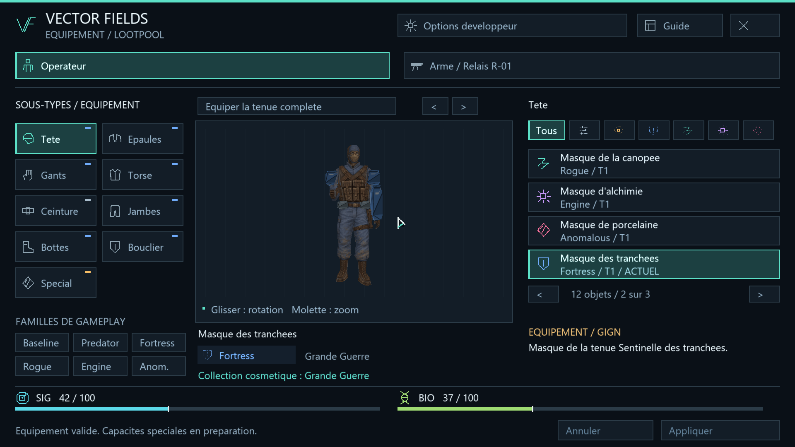
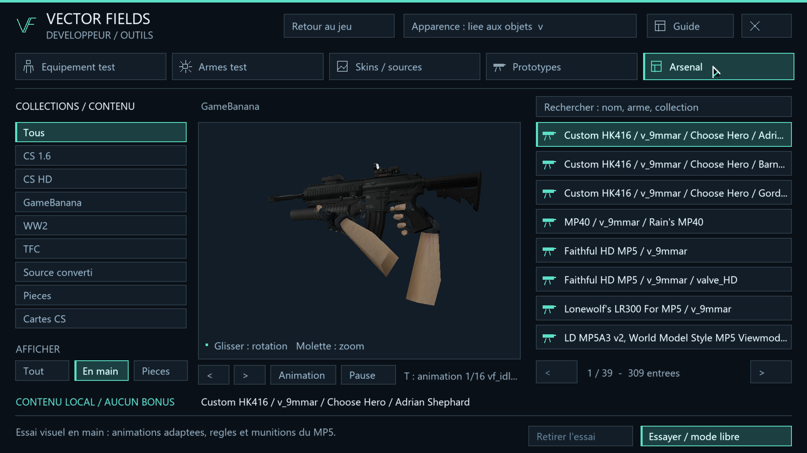

# Vector Fields 0.14.0 — gameplay et outils développeur

Le lanceur reste **Jouer - Vector Fields.cmd**. Le menu principal présente
**Opérateur** et **Arme / Relais R-01**. Le personnage démarre dans la tenue
Sentinelle des tranchées, avec son arme Grande Guerre.



## Équipement de gameplay

L'interface opérateur conserve ses **neuf emplacements** et les budgets SIG/BIO.
Les cinq zones déjà produites utilisent le corps GIGN ajusté sur lequel les
skins ont été créés, avec son squelette adapté : tête, torse/bras, gants,
jambes et bottes. Chaque choix est un objet nommé, lié à une apparence précise.
**Équiper la tenue complète** propose les cinq pièces de la même tenue ;
**Appliquer** valide le choix auprès du serveur.

**Épaules, ceinture, bouclier et spécial conservent leurs objets et leurs
modèles provisoires**, visibles sur le personnage. Ils restent sélectionnables,
peuvent être retirés et continuent à contribuer aux budgets. Leur remplacement
artistique sera traité plus tard.

Le panneau Arme utilise les **26 pièces R1**, les trois plateformes de
chargement et les douze finitions. Les prototypes HK416, MP40, Thompson,
Nailgun et leurs anciens assemblages ne figurent plus dans cette sélection.
Le changement de collection R1 conserve la famille et les coûts de la pièce.

## Famille, collection et lootpool

Les familles de gameplay restent **Baseline, Predator, Fortress, Rogue,
Engine et Anomalous**. La collection cosmétique est affichée séparément.
Les thèmes Grande Guerre, Bedrock, New York noir, Bois de naufrage, Abysses,
et les collections précédentes ne remplacent pas ces familles.

Le [lootpool généré](../data/lootpool.json) contient **396 entrées** :

| Contenu | Entrées | Référence utilisée |
| --- | ---: | --- |
| Pièces de tenue GIGN | 60 | 12 tenues × 5 zones |
| Pièces R1 avec finition | 312 | 26 pièces × 12 collections |
| Équipements provisoires conservés | 24 | 4 emplacements × 6 familles |

Chaque entrée possède un identifiant stable, un nom, une famille, un emplacement,
un statut de modèle, un poids initial et les références nécessaires à
l'équipement/rendu. Douze ensembles opérateur nommés référencent leurs cinq pièces.
Les index numériques sont réservés au transport local ; une intégration future
doît conserver l'identifiant stable comme clé de sauvegarde du loot.

Exemples : `gign_gloves_noir` désigne les Gants de minuit, famille Predator,
collection New York noir ; `r01_optic_b__abyss-diver` désigne la lunette
compacte avec la collection Abysses. Les épaulettes et le bouclier sont marqués
`placeholder`, tout en appartenant au pool de gameplay.

Les drops dans le monde et l'acquisition par inventaire ne sont pas encore
implémentés. Cette version fournit le registre exploitable et son application
réelle dans l'interface d'équipement. Les poids et coûts restent provisoires.

## Options développeur



**Options développeur**, **F6** ou **F7** ouvre l'espace contenant :

- Équipement test et armes test : catalogues historiques conservés.
- Skins / sources : apparence libre, donneurs HL/TFC/CS, isolation et animations.
- Prototypes : anciens assemblages de visualisation et pièces importées.
- Arsenal : bibliothèque complète, essais en main, accessoires et cartes.
- Guide / Effets : effets locaux, comparaisons et contrôles de visualisation.

**Retour au jeu** restaure la configuration de gameplay mémorisée dans la session,
réactive les apparences liées aux objets et retire l'essai d'arme importée.
Les mannequins TFC de référence sont affichés uniquement en mode développeur.
Les ressources historiques restent sur disque pour ces outils.

| Touche | Action |
| --- | --- |
| F1 / F2 | Opérateur |
| F11 | Arme R1 |
| F6 / F7 | Options développeur |
| F3 | Outils développeur d'effets |
| F5 | Visite développeur de 2fort |
| F4 | Laboratoire et configuration de démarrage |
| Échap / croix | Fermer l'interface |

## Données, construction et vérification

- [gameplay-content.json](../data/gameplay-content.json) : noms des collections,
  tenues et affectations aux familles.
- [build_lootpool.py](../build_lootpool.py) : génération des objets GIGN, familles
  R1, noms des finitions et registre de loot ; exécuté par le build et le lanceur.
- [equipment.txt](../data/equipment.txt) : objets historiques et de gameplay.
  La colonne d'apparence optionnelle pointe vers une clé du catalogue GIGN.
- `GameplayItem` filtre les objets proposés en jeu ; `EquipmentSkins` résout
  les cinq zones dans le client et le serveur. Les changements restent validés
  atomiquement et transmis avec l'empreinte du catalogue.

```powershell
./vector-fields/build.ps1
python vector-fields/play.py --visual-lab --deploy-only
python vector-fields/tests/gameplay_engine_test.py
python vector-fields/tests/current_release_test.py
& ".\Jouer - Vector Fields.cmd"
```

Compilation client/serveur : **1 354 contrôles d'équipement** et **10 601 contrôles
d'effets**. Les tests natifs couvrent le mélange de zones GIGN, les emplacements
provisoires, R1, l'accès aux contenus historiques, la restauration après un essai
dev et la sauvegarde/reprise. Le déploiement contrôle aussi les empreintes de
31 modèles générés. Rapports dans `docs/validation/0.14.0`.

Les limites de rendu précédentes subsistent : mains en première personne propres
au modèle d'arme, modèle porté externe historique et comportement de tir du MP5.
Les capacités annoncées par les familles ne constituent pas encore des effets de
combat implémentés.
